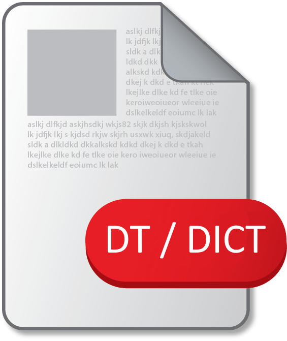
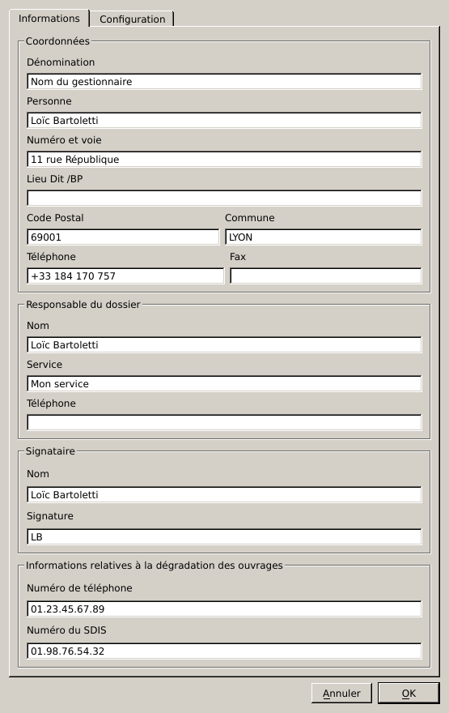
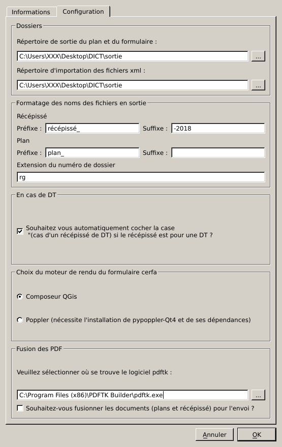
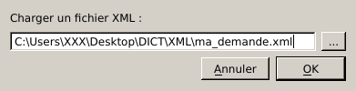
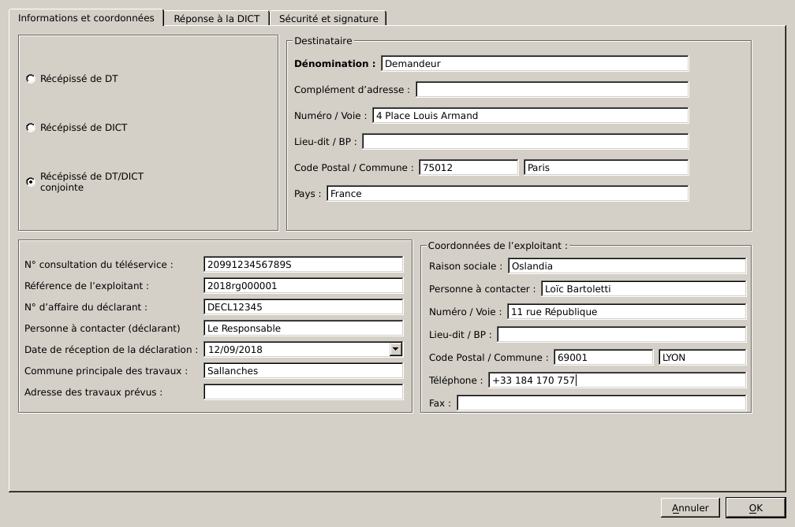
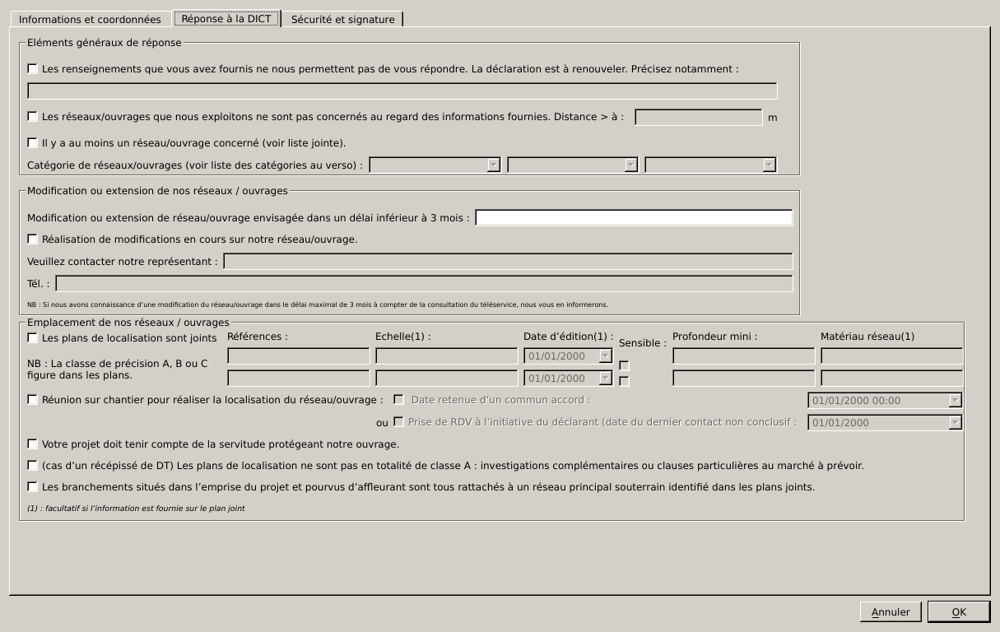
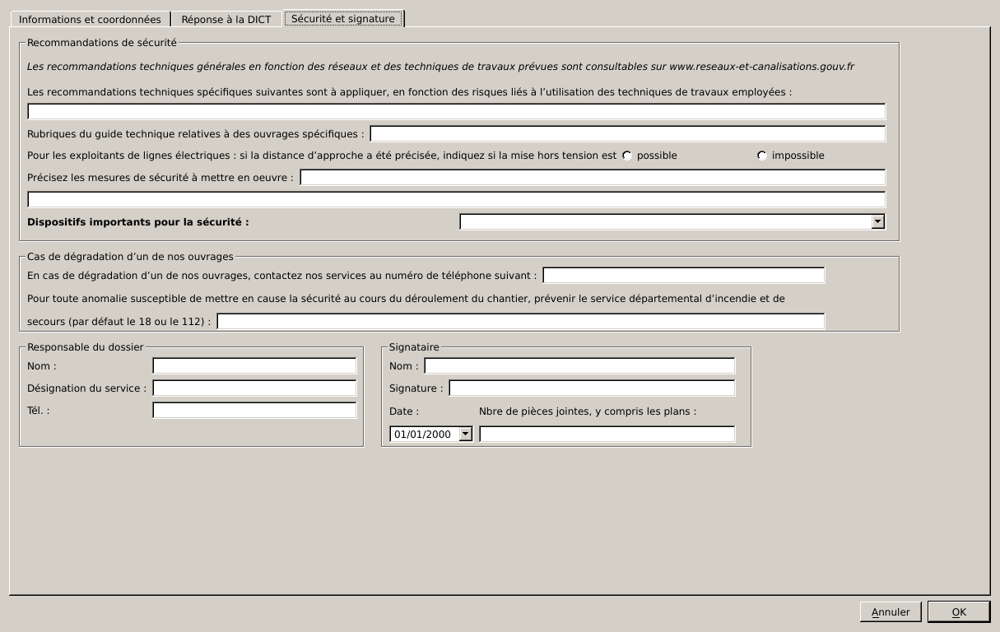
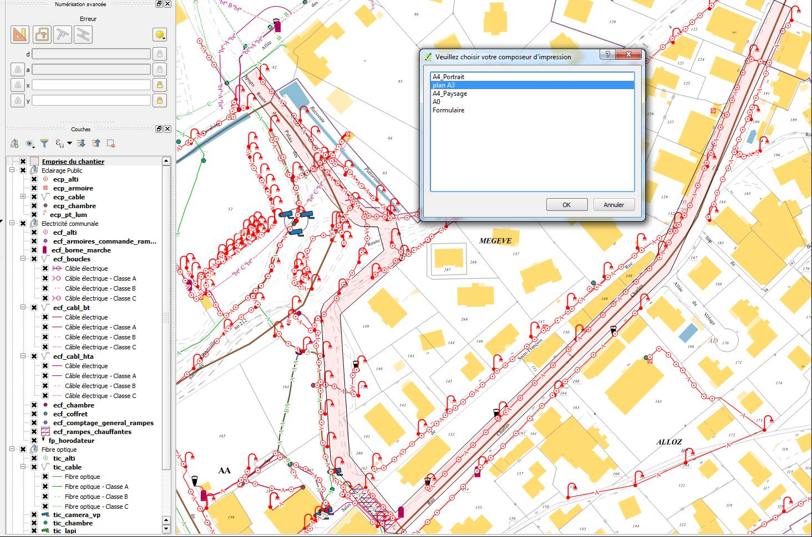

# Introduction

Afin de répondre à certaines demandes en interne j'avais développé ce plugin QGis pour traiter les XML des DT/DICT.

Le développement a été abandonnée, mais va reprendre si le financement le permet. C'est à ce jour la seule solution opensource existante sur le marché.

# Utilisation

L'outil est composé de deux bouttons : un pour traiter un XML (à gauche)  et un pour configurer le plugin (à droite) .

## Configuration
La configuration permet à l’utilisateur de ne pas avoir à répéter la saisie des informations et indiquer où et comment doivent sortir les PDF.

## Traitement de la DT/DICT

Le XML reçu est à ouvrir via la boîte de dialogue suivante :

Vous serez ensuite guidé par un assistant qui reprend la logique du formulaire PDF. Des contrôles sont en place pour éviter les erreurs de saisie.

Le plugin doit s'utiliser sur un projet ouvert comprenant vos réseaux et les composeurs d'impression qui seront utilisés pour la sortie des plans.
Après avoir rempli le formulaire, vous devez sélectionner le composeur pour l'impression PDF. Vous pouvez noter une emprise de chantier indiquant l'emprise de la demande.

Une fois le traitement effectué vous pouvez récupérez le formulaire pdf et les plans. Ils seront fusionnés si vous avez configuré cette option.

